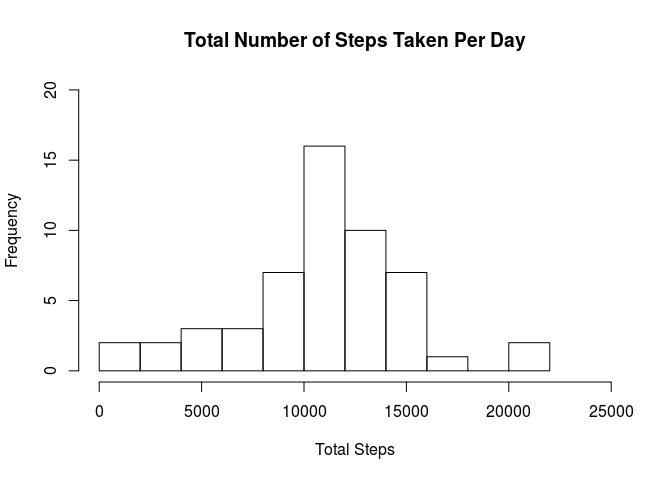
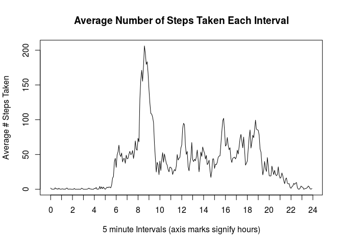
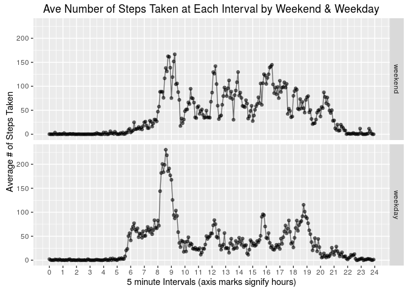

# Reproducible Research: Peer Assessment 1


## Loading and preprocessing the data


```r
activity <- read.csv("activity.csv")
nbDays <- length(levels(activity$date))
activity$date <- as.Date(activity$date)
```


## What is mean total number of steps taken per day?
1. Histogram:

```r
library(dplyr)
activityDaily <- group_by(activity[complete.cases(activity),], date) %>% summarize(dailySteps = sum(steps))
hist(activityDaily$dailySteps, main="Total Number of Steps Taken Per Day", xlab = "Total Steps", breaks = 10, xlim = c(0,25000), ylim = c(0,20))
```

<!-- -->

2. The mean total number of steps taken per day is:

```r
round( mean(activityDaily$dailySteps) )
```

```
## [1] 10766
```
The median total number of steps taken per day is:

```r
round( median(activityDaily$dailySteps) )
```

```
## [1] 10765
```


## What is the average daily activity pattern?
1. Time Series Plot:

```r
activityInterval <- group_by(activity, interval) %>% summarize(intervalMeanSteps = mean(steps, na.rm = TRUE))
activityInterval$interval <- seq(0, 1435, 5)
plot(activityInterval$interval, activityInterval$intervalMeanSteps, xaxt = "n", type = "l", main = "Average Number of Steps Taken Each Interval", ylab = "Average # Steps Taken", xlab = "5 minute Intervals (axis marks signify hours)") 
axis( 1, at = seq(0, 1440, 60), labels  = seq(0, 24, 1))
```

<!-- -->

2. The maximum average steps by 5-minute interval occurs at:

```r
activityIntervalMax <- which.max(activityInterval$intervalMeanSteps)
activityIntervalMax <- activityIntervalMax*5 - 5
MaxHr <- floor(activityIntervalMax/60)
MaxMn <- 60 * (activityIntervalMax/60 - MaxHr)
paste( as.character(MaxHr), "hours and", as.character(MaxMn), "minutes."  )
```

```
## [1] "8 hours and 35 minutes."
```


## Imputing missing values
1. Total number of missing values in the dataset:

```r
sum(!complete.cases(activity))
```

```
## [1] 2304
```

2. Missing steps values at a particular 5-mintue interval are replaced by the mean step value for that interval.

3. Create new dataset with missing values imputed: 

```r
imputeVec <- rep(activityInterval$intervalMeanSteps, times = nbDays)
activityNew <- activity
activityNew$steps[is.na(activityNew$steps)] <- 0 
activityNew$steps <- activityNew$steps + ( as.numeric(is.na(activity$steps)) * imputeVec )
```

4. Histogram:

```r
activityDaily <- group_by(activityNew, date) %>% summarize(dailySteps = sum(steps))
hist(activityDaily$dailySteps, main="Total Number of Steps Taken Per Day", xlab = "Total Steps", breaks = 10, xlim = c(0,25000), ylim = c(0,25))
```

<!-- -->

The mean total number of steps taken per day is:

```r
round( mean(activityDaily$dailySteps) )
```

```
## [1] 10766
```
The median total number of steps taken per day is:

```r
round( median(activityDaily$dailySteps) )
```

```
## [1] 10766
```

Imputing missing data in this way has no impact on the mean (as expected) and increases the median slightly.


## Are there differences in activity patterns between weekdays and weekends?
1. Create new factor variable:

```r
activityNew$weekday <- factor( weekdays(as.Date(activityNew$date)) %in% c("Saturday", "Sunday"), labels = c("weekday", "weekend"))
```

2. Panel plot:

```r
library(ggplot2)
activityNew$interval <- rep( seq(0, 1435, 5), times = nbDays)
activityNewInterval <- split(activityNew, activityNew$weekday)
activityNewInterval <- lapply(activityNewInterval, group_by, interval)
activityNewInterval <- lapply(activityNewInterval, summarize, intervalMeanSteps = mean(steps, na.rm = TRUE), weekday = as.factor(weekday[1]) )
activityNewInterval <- as.data.frame( do.call('rbind', activityNewInterval) )
activityNewInterval$weekday <- factor(activityNewInterval$weekday, levels(activityNewInterval$weekday)[c(2,1)])

g <- qplot(interval, intervalMeanSteps, data = activityNewInterval, facets = weekday~., alpha = 0.01, xlab = "5 minute Intervals (axis marks signify hours)", ylab = "Average # of Steps Taken", main = 'Ave Number of Steps Taken at Each Interval by Weekend & Weekday')  
myplot <- g + geom_line()  + scale_x_continuous(breaks=seq(0, 1440, 60), labels  = seq(0, 24, 1) ) + theme(legend.position = "none")

print(myplot)
```

<!-- -->
